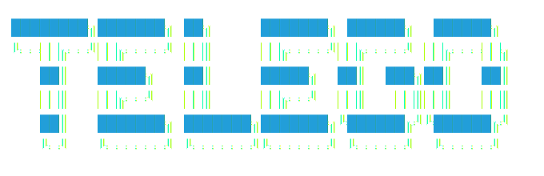

<div align="center">



# Telegodex

**一个 Telegram Workbench 项目。通过 Telegram 控制你的 Codex。**  
支持多 AI 服务商、TOML Provider 注册表、Codex bridge 基础，以及 Telegram 原生富文本输出。

<p>
  <a href="../../LICENSE"></a>
  <a href="#技术栈"></a>
  <a href="https://docs.aiogram.dev/"></a>
  <a href="#技术栈"></a>
  <a href="#路线图"></a>
</p>

[English](../../README.md) · <u>简体中文</u> · [日本語](./README.ja.md)

</div>

---

## 项目定位

Telegodex 是一个基于 Telegram 的本地 CLI AI 工作台，用来让你从手机控制电脑上的 AI 命令行工作流。

你是否需要在不带电脑时，查看、审批或继续终端里的 AI CLI Agent 工作？官方移动端控制通常会受到客户端类型、登录状态或 API 接入方式的限制。Telegodex 把这类工作流放到 Telegram 里。

它的首要目标，是让你可以在 Telegram 中接近电脑原生终端交互地连接、渲染和控制 CLI Agent，例如 Codex CLI 和 Claude Code。受控的 CLI 作为本地子进程运行，项目只负责把命令行交互同步到 Telegram，不对 AI 编程助手本身做注入或篡改。

它面向三件事：

- **远程控制 Codex / CLI Agent。** 在 Telegram topic 中恢复、绑定、操作、审批和查看终端级 AI 工作。
- **辅助多服务商 AI Chat。** 不离开 Telegram，就能用 OpenAI、Anthropic、Google、DeepSeek、Qwen、Kimi、GLM 和 ERNIE 问一些旁路问题。
- **TOML Provider 注册表。** 通过 `provider.toml` 接入、停用或切换 OpenAI-compatible endpoint。

Telegodex 同时保留原生 Bot 聊天通道，方便日常轻量提问。你可以在同一个 Telegram 空间里，在快速 AI Chat 和终端级 Agent 控制之间切换。

---

## 当前能力

- **从 Telegram 控制 Codex 工作流。** 发送提示词、恢复 thread、接收流式输出、处理审批，并把交互留在移动端。
- **用 Telegram 原生方式渲染 AI 输出。** 代码块、表格、列表、引用、可折叠区域、公式和结构化摘要。
- **统一多服务商体验。** 同一套 handler，同一套 UX，不同后端。
- **支持本地和自托管端点。** Ollama、vLLM、LiteLLM、Azure、LM Studio，以及其它 OpenAI-compatible 服务。
- **控制普通聊天里的本地工具使用。** 可以保持仅对话、通过内联按钮确认，或允许已授权的 shell 工具直接运行。
- **保存用户级会话状态。** 历史记录、偏好、模型选择、temperature 和限流配置。

---

## 当前重点

当前开发重点，是把 Telegram 做成本地 CLI Agent 的移动工作台，同时保留多服务商聊天基础，便于快速旁路提问。

### Stage 1
- 辅助多服务商聊天基础
- TOML Provider 注册表
- Telegram 原生渲染
- 存储、偏好和安全

### Stage 2
- 基于 `codex app-server` 的 Codex CLI bridge 基础
- Codex thread 恢复、Telegram topic 绑定和输出流式传输
- 内联审批提示
- 工具调用可见性和本地 shell 权限控制

### Stage 3
- 完整 Codex topic workbench UX
- 在 Codex 暴露相关能力时呈现 Codex 自身的后台/子代理活动
- Claude Code / 其它 CLI bridge
- Dashboard 和部署工具

---

## 快速开始

```bash
git clone https://github.com/CYcha/Telegodex.git
cd Telegodex
pip install -r requirements.txt
cp .env.example .env
cp provider.toml.example provider.toml
```

在 `.env` 中设置 `TELEGRAM_BOT_TOKEN` 和 `provider.toml` 引用的服务商 key。
然后在 `[global].available_providers` 中选择启用的 Provider，并运行：

```bash
python run.py --check-config
python run.py
```

在 Telegram 里向你的 Bot 发送 `/start`。

完整步骤见：[docs/QUICKSTART.md](../QUICKSTART.md)

---

## 添加自定义 Provider

```toml
[global]
default_provider = "ollama"
available_providers = ["ollama"]

[providers.ollama]
transport = "openai_compatible"
api_key_literal = "ollama"
base_url = "http://localhost:11434/v1"
default_model = "llama3.2"
models = ["llama3.2"]
```

把这段加入 `provider.toml`，运行 `python run.py --check-config`。运行中的 Bot 会从 `provider.toml` 热重载 Provider 和模型列表；只有进程级环境变量需要变更时才需要重启。

参考：[docs/CUSTOM_PROVIDERS.md](../CUSTOM_PROVIDERS.md)

---

## 目录结构

```text
ai/          BaseAIProvider 和服务商实现
bot/         aiogram handlers、keyboards、rich rendering
storage/     SQLAlchemy async ORM (User, Conversation, Message)
security/    rate limit、admin gate、input validation
extensions/  Codex 和 Claude Code bridges
```

Provider 契约：

- `chat()`
- `chat_stream()`
- `get_available_models()`
- `validate_api_key()`

router 选择 Provider。  
handler 不关心具体后端。

---

## 支持的服务商

| 区域 | Provider | 默认模型 |
|---|---|---|
| International | OpenAI, Anthropic, Google | 在 `provider.toml` 中配置 |
| China | DeepSeek, Qwen, Kimi, GLM, ERNIE | 在 `provider.toml` 中配置 |

任何 OpenAI-compatible endpoint 都可以通过 `provider.toml` 接入。

完整目录见：[docs/MODELS.md](../MODELS.md)

---

## 技术栈

Python 3.11+ · aiogram 3.x · SQLAlchemy 2.x async · Pydantic Settings · Alembic · Redis (optional)

---

## 文档

- [Quickstart](../QUICKSTART.md)
- [Usage](../USAGE.md)
- [产品体验](../PRODUCT_EXPERIENCE.md)
- [Architecture](../ARCHITECTURE.md)
- [Custom providers](../CUSTOM_PROVIDERS.md)
- [Model catalog](../MODELS.md)
- [Rich messages](../RICH_MESSAGES.md)

---

## 路线图

- [x] 多服务商抽象
- [x] Telegram Rich rendering
- [x] 上下文窗口和用户偏好
- [x] Codex bridge 基础
- [x] 热重载模型机制
- [ ] Codex thread 恢复和 Telegram topic 绑定打磨
- [ ] 完整 Codex Workbench UX
- [ ] Claude Code bridge
- [ ] 在上游 CLI runtime 暴露相关能力时，呈现长任务、resume 状态和子代理活动
- [ ] Web admin dashboard
- [ ] Voice and image input
- [ ] Docker compose & Helm chart

---

## 贡献

提交前请阅读 [docs/ARCHITECTURE.md](../ARCHITECTURE.md)。

---

## Star History

[](https://star-history.com)

---

## 许可证

MIT。见 [LICENSE](../../LICENSE)。
